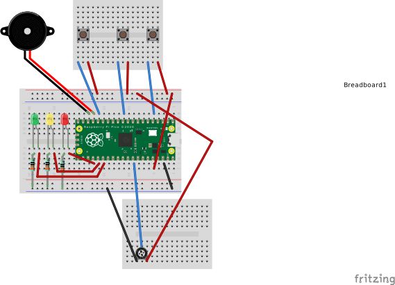
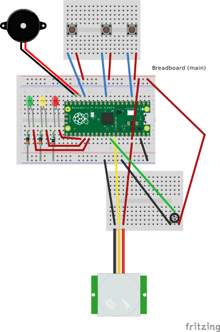

# Raspberry Pi Pico - 12 days of hacking / coding

https://thepihut.com/advent

## Day 1 - OnBoard LED

- Blink with onboard LED

[Code: day1.py](day1.py)

## Day 2 - Color LEDs

- Traffic light sequence (Red, Amber, Green LEDs)

[Code: day2.py](day2.py)

## Day 3 - Buttons

- Print ID of the pressed button

[Code: day3.py](day3.py)

## Day 4 - Potentiometer

- Read value from potentiometer
- Print the value
- Depending on the value, turn on either red, or amber, or green light

[Code: day4.py](day4.py)

### Traffic Lights

- Turn on red, amber, green lights one by one
- Read value from potentiometer
- Depending on the value, speed up or slow down the sequence

[Code: day4-glow.py](day4-glow.py)

### 'Brightness'

- Depending on the value from potentiometer, change brightness of the green LED

[Code: day4-pwm.py](day4-pwm.py)

## Day 5 - Buzzer

- Play "Jingle Bells"

[Code: day5.py](day5.py)

### Radio with several stations

- Click any button to play/stop
- Use potentiometer to change radio
- Onboard LED displays the running state of the project
- Color LEDs show different notes played
- Color LEDs blink when a button is pressed
- "Pshhht" sound when "radio station" is changed

[Code: day5-with-button-radio.py](day5-with-button-radio.py)
    

## Day 6 - Light sensor

- Read light sensor value
- Depending on the value, turn on either red, or amber, or green LED

[Code: day6.py](day6.py)

## Day 7 - Proximity Sensor

- Warm up PIR (Passive Infra-Red Sensor)
- If proximity sensor sends a signal, turn on alarm (1 cycle)

[Code: day7.py](day7.py)

### Project: Alarm (Proximity Sensor) with security code

- Wait for PIR to get ready
- Click any button to set the alarm, wait for 3 seconds and play "start" jingle
- If the motion is detected, play alarm sound
- While playing alarm sound allow user to enter code using sequence of the buttons
- If code is correct, play "stop" jingle and de-activate alarm
- If code is wrong or more than 5 seconds passed since first button press, play "wrong code" jingle
- If alarm is de-activated, user can press any button to set alarm again
- Minor change in schematics comparing to day 5 (the potentiometer central pin is in a different place)

[Code: day7-alaram-with-volume-and-code.py](day7-alaram-with-volume-and-code.py)

## Day 8 - Temperature Sensor

- turn on onboard LED
- wait for 5 seconds befor first reading
- if reading is not as the previous one +/- 0.05 - print its value
- if reading < 18 - turn on red led (Pin(20))
- if 18 < reading < 22 - turn on amber led (Pint(19))
- if reading > 22 - turn on green led (Pin(18))
- when switching led, use buzzer to "beep" PWM(Pin(13))
- use potentiometer to control voluem (ADC(Pin(27)))

[Code: day8.py](day8.py)

## Day 9 - Tilt Sensor

- Display how many times the sensor got tilted

[Code: day9.py](day9.py)

## Day 10 - A Pair of Infrared Sensors

- A game where the player should cross the line as many times as possible in 1 minute

[Code: day10.py](day10.py)

## Day 11 - OLED screen

- Display light level

[Code: ssd1306.py](ssd1306.py)
[Code: day11.py](day11.py)

### Basic indoor weather station

- Get temperature and humidity from [KY-015 sensor](https://www.rp2040learning.com/code/micropython/a-raspberry-pi-pico-and-ky-015-temperature-sensor.php)
- Get light level from the light sensor
- Display data on the OLED
- Use button to turn the screen on and off

[Code: ssd1306.py](ssd1306.py)
[Code: ky015.py](ky015.py)
[Code: day11-with-ky015.py.py](day11-with-ky015.py.py)

